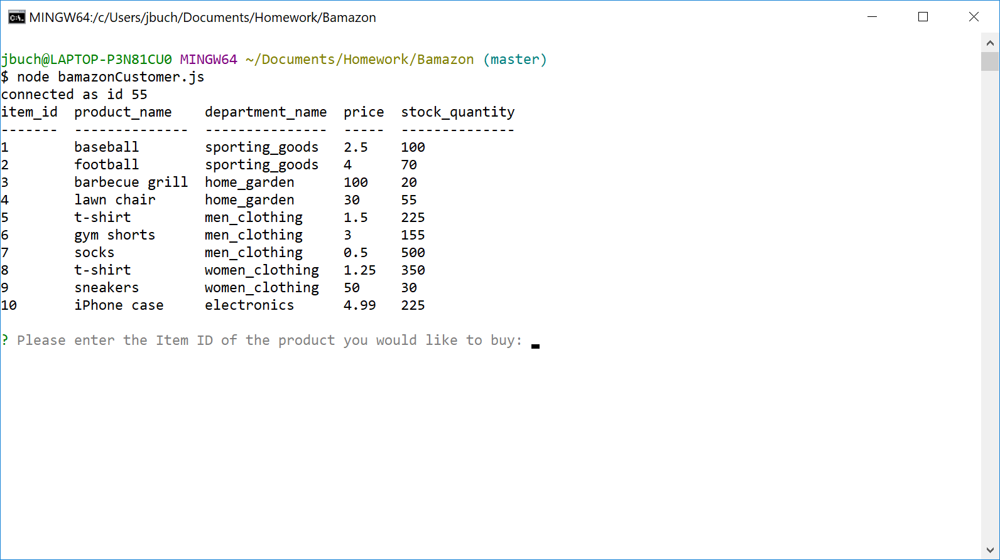
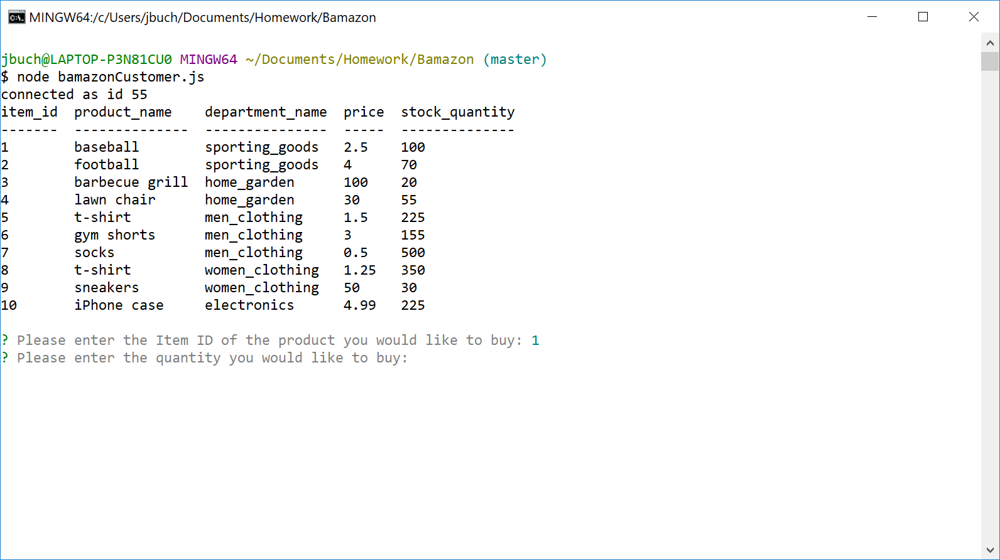
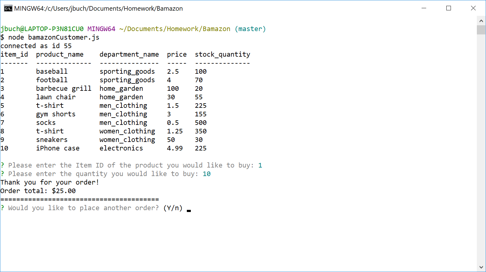
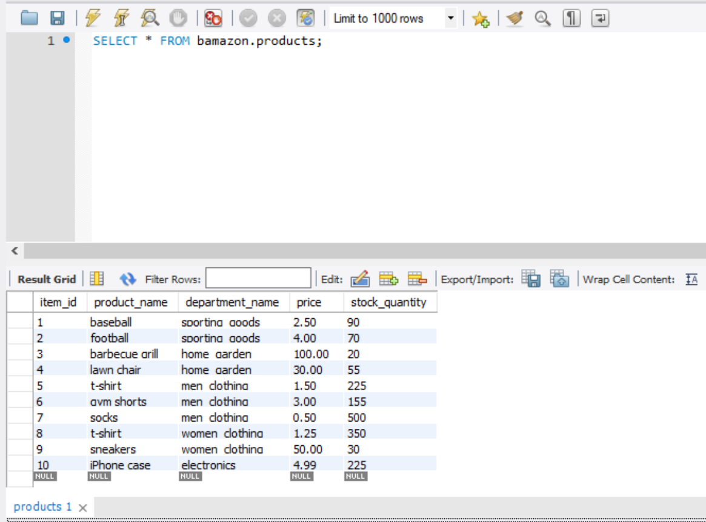
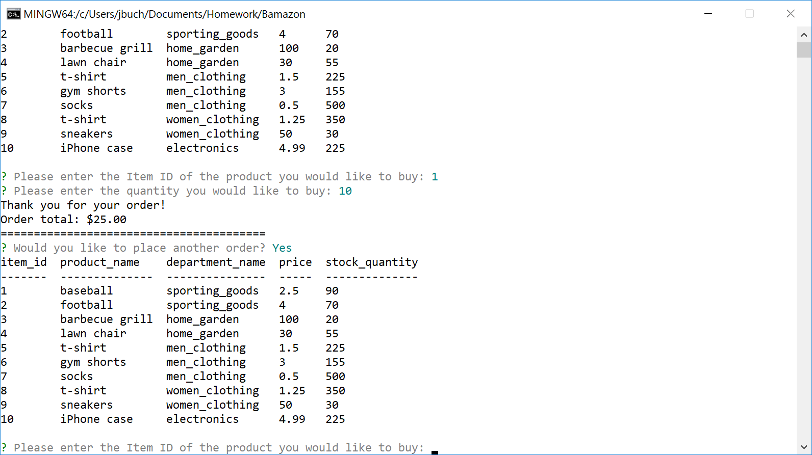
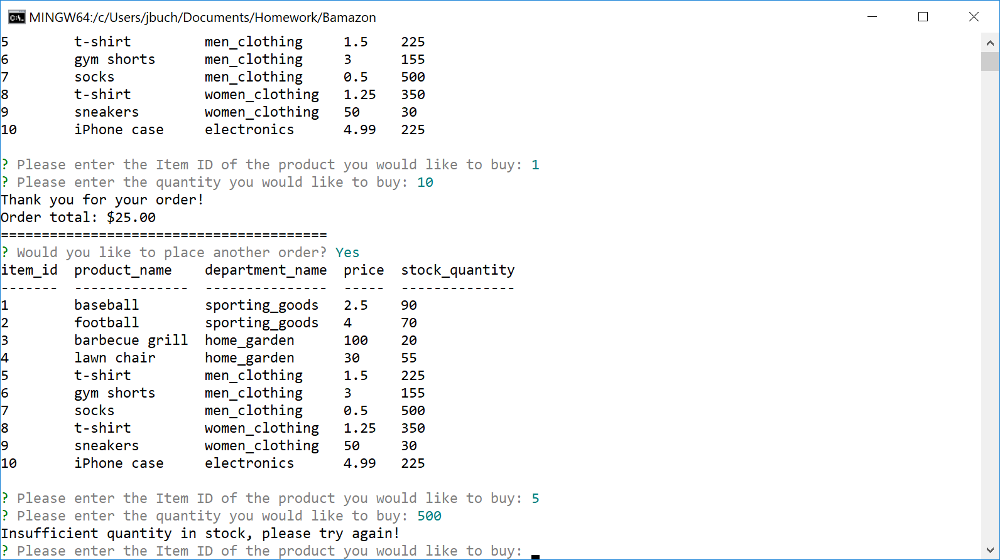
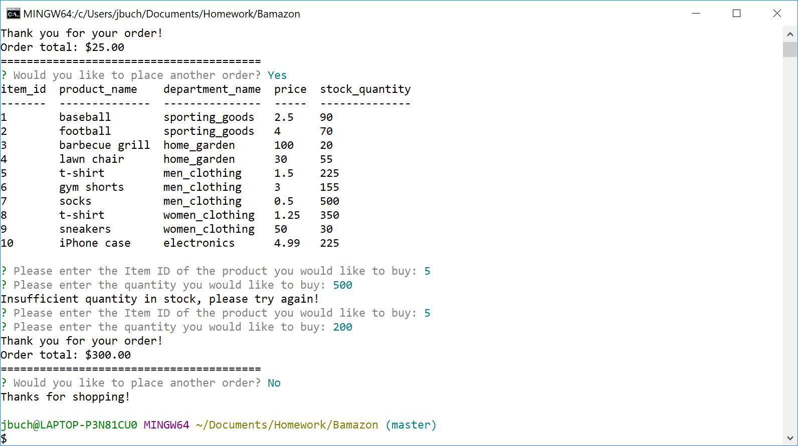

# Bamazon

## About this Project
This is a shopping app with a wide selection of products available for purchase. The user will select the item and quantity to order, and the app will confirm that the quantity is available. Then the quantity will be deducted from the store inventory via SQL, and the user's order total will be displayed.

Technologies used in this app include Node.js, Inquirer and MySQL.

## Screenshots
1. The initial view of the storefront. The user is prompted for an Item ID.

2. The storefront product table matches the SQL table.

3. The user inputs an Item ID, and is prompted for a quantity. The Inquirer prompt includes validation to make sure the Item ID entered is a valid inventory item.

4. The user inputs the quantity, and the order total is calculated.

5. The SQL table is updated to deduct the quantity purchased.

6. If the user chooses to place another order, the updated product table is displayed.

7. The user tries to purchase a greater quantity than was available in stock. A warning is displayed and the user may try again.

8. After this order is calculated, the user does not wish to place another. The app will exit.

## Install and Run
Clone the repository to your local machine. Run `npm install` to install the dependencies. Import `schema.sql` in your favorite MySQL administrator console. Then run `node bamazonCustomer.js` to start the program.

## Deployed Site
Not applicable, because this is a Node.js CLI app.

## My Portfolio
[https://joseph526.github.io/](https://joseph526.github.io/)